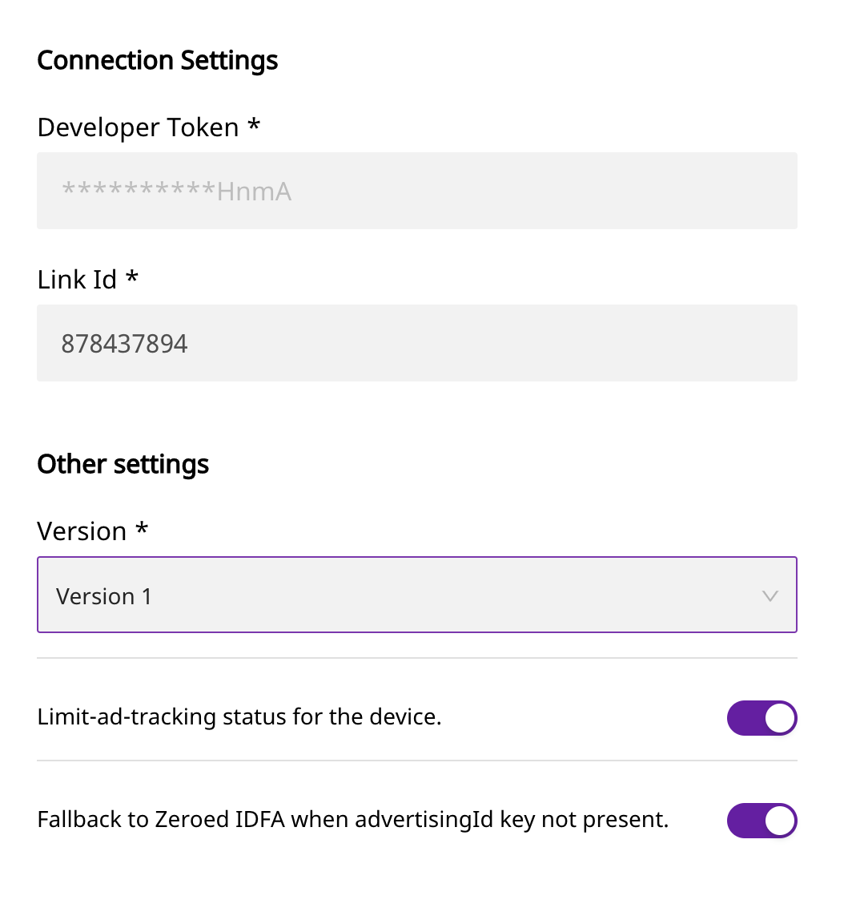

# Google Ads Classic

With google ads conversion tracking you can measure the effectiveness of your mobile app install and app engagement campaigns. Then reach existing users with ads to re-engage them with your app, driving even more conversions.

Google recently announced an entirely new API for Google Ads app conversion tracking and remarketing. The primary drivers for developing this new API are to make app analytics and attribution simpler for advertisers and more reliable for Google Ads attribution partners.

RudderStack supports sending events from RudderStack SDKs to the Google Ads App conversion and remarketing endpoints. We support the connection mode **S2S** **\(Server-to-Server\)** through our data plane.

## Getting Started

Before configuring your source and destination on the RudderStack app, please check whether the platform you are working on is supported by Google ads Classic. Refer to the table below:

| **Connection Mode** | **Web** | **Mobile** | **Server** |
| :--- | :--- | :--- | :--- |
| **Device Mode** | - | - | - |
| **Cloud Mode** | **Supported** | **Supported** | **Supported** |


To know more about the difference between Cloud mode and Device mode in RudderStack, read the [RudderStack connection modes](https://docs.rudderstack.com/get-started/rudderstack-connection-modes) guide.


Once you have confirmed that the platform supports sending events to Google Ads Classic, perform the steps below:


Please follow our guide on [How to Add a Source and Destination in RudderStack](https://docs.rudderstack.com/how-to-guides/adding-source-and-destination-rudderstack) to add a source and destination in RudderStack.


Once the destination is enabled, events from our servers will start flowing to Google Ads and you can see the data event in the conversions tab of the manager account.

## Settings

1. Developer Token - A developer token is needed to be created for allowing to send data to the app conversion and remarketing end point.
As we are a third party all requests will be sent with the token lcJPreX3Geqri8JrUWHnmA.
2. Link Id - A link ID is a unique identifier for binding a specific app to a specific developer token. To create a link ID associated with your unique developer token, select Other provider from the app analytics provider dropdown. In the input box labeled Enter your provider's ID : 8362721282. 
3. Version - Now Google Ads Classic has only 1 version.
4. Limit ad tracking status for the device - Enable this to set Limit Ad Tracking to true when context.device.adTrackingEnabled is false.
5. Fallback to 0 IDFA when advertisingId key is not present - If adTrackingEnabled is set to false, the advertisingId key will be deleted from the event. If the advertisingId is not present rdid will not be set and the event will not be sent to Google Ads Classic. Thus to avoid this if this is turned on and advertisingId is not present rdid will be set to '00000000-0000-0000-0000-000000000000'.

## Track

